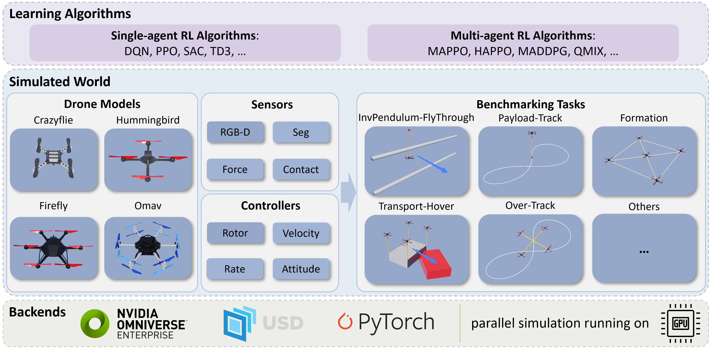

.. EECS106B documentation master file, based on OmniDrones.
   You can adapt this file completely to your liking, but it should at least
   contain the root `toctree` directive.

Welcome to EECS106B's documentation!
=====================================

**EECS106B** is based on `OmniDrones <https://github.com/btx0424/OmniDrones>`__, an open-source platform designed for reinforcement learning research on multi-rotor drone systems.
Built on `Nvidia Isaac Sim <https://docs.omniverse.nvidia.com/app_isaacsim/app_isaacsim/overview.html>`__,
it features highly efficient and flexible simulation that can be adopted for various research purposes.

The platform, as released with `the OmniDrones paper <https://arxiv.org/abs/2309.12825>`__, currently focuses on end-to-end
learning of agile controllers for drones. It offers a suite of benchmark tasks and algorithm baselines to provide
preliminary results for subsequent works.

An overview of the platform is shown below:

If you use this platform in your research, please cite the original OmniDrones paper:

.. code-block:: bibtex

   @misc{xu2023omnidrones,
      title={OmniDrones: An Efficient and Flexible Platform for Reinforcement Learning in Drone Control},
      author={Botian Xu and Feng Gao and Chao Yu and Ruize Zhang and Yi Wu and Yu Wang},
      year={2023},
      eprint={2309.12825},
      archivePrefix={arXiv},
      primaryClass={cs.RO}
   }

.. toctree::
   :caption: Getting Started
   :maxdepth: 2

   installation
   rl
   troubleshooting

.. toctree::
   :caption: Demos
   :maxdepth: 2

   demo/tasks
   demo/downwash
   demo/crazyflie
   demo/lidar

.. toctree::
   :caption: Tutorials
   :maxdepth: 2

   tutorials/drone
   tutorials/environment
   tutorials/controller

.. toctree::
   :caption: Tasks
   :maxdepth: 2

   tasks/single
   tasks/multi

.. toctree::
   :caption: Misc.

   roadmap

Indices and tables
==================

* :ref:`genindex`
* :ref:`modindex`
* :ref:`search`
